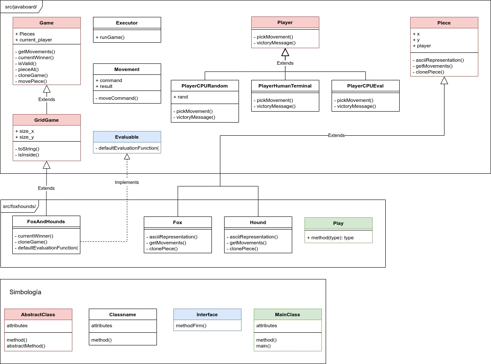
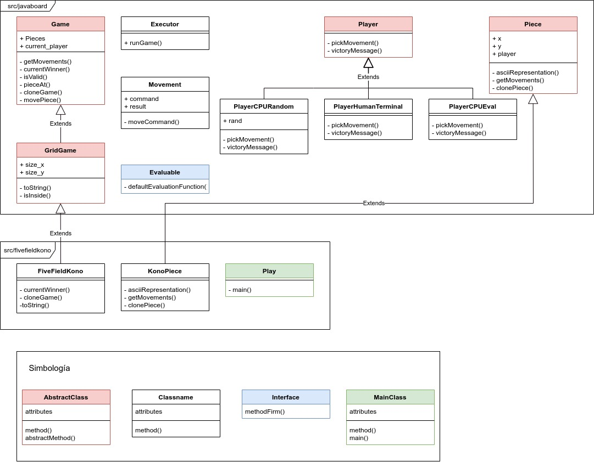

# Project 2 - Javaboard
Java framework for Board Games (exercise).

## Class Diagrams
### Fox and Hounds

### Five Field Kono

### How to execute

1. join in javaboard-master directory
2. make [game name]
3. java -jar [game_name].jar
